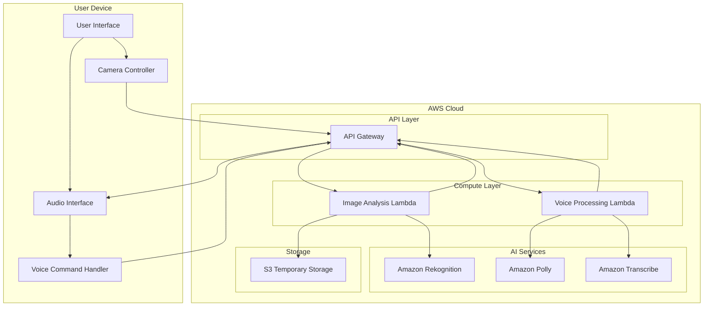

# Design Document: AI Vision Assistant

## Overview

The AI Vision Assistant is a cloud-based accessibility system that provides on-demand visual analysis for visually impaired users. The system follows a snapshot-based architecture where users capture single image frames through voice commands or button presses, which are then analyzed by AWS AI services and results are spoken back to the user.

The design prioritizes cost-effectiveness, accessibility, and simplicity suitable for a hackathon demonstration while maintaining extensibility for future enhancements. The system uses a serverless architecture on AWS to minimize operational overhead and costs.

## Architecture

The system follows a three-tier architecture:

1. **Frontend Layer**: Device-native applications (mobile apps, web apps) that handle camera access, user interface, and local audio processing
2. **Backend Layer**: AWS Lambda functions that orchestrate AI service calls and manage request/response processing
3. **AI Services Layer**: AWS managed services (Rekognition, Polly, Transcribe) that provide computer vision and speech capabilities

### High-Level Architecture Diagram



## Components and Interfaces

### Frontend Components

#### Camera Controller
- **Purpose**: Manages camera access and image capture
- **Responsibilities**:
  - Initialize camera with appropriate resolution (1080p max for cost optimization)
  - Provide live preview for sighted users during demos
  - Capture single frames on command
  - Handle camera permissions and error states
- **Interface**: Exposes `captureImage()` method returning base64-encoded image data

#### Voice Interface
- **Purpose**: Handles speech input and audio output
- **Responsibilities**:
  - Capture voice commands using device microphone
  - Play text-to-speech audio responses
  - Provide audio feedback for user actions
  - Handle audio permissions and device compatibility
- **Interface**: Exposes `processVoiceCommand(audioData)` and `speakText(text, options)`

#### User Interface Controller
- **Purpose**: Orchestrates user interactions and system flow
- **Responsibilities**:
  - Coordinate between camera, voice, and backend services
  - Manage application state and user session
  - Handle error states and provide user feedback
  - Implement accessibility features
- **Interface**: Main application controller with event-driven architecture

### Backend Components

#### Image Analysis Service
- **Purpose**: Processes image analysis requests
- **Responsibilities**:
  - Receive and validate image data from frontend
  - Optimize image size and format for AI services
  - Call Amazon Rekognition for object detection and text recognition
  - Format analysis results for speech output
  - Implement cost controls and rate limiting
- **Interface**: REST API endpoint `/analyze-image` accepting POST requests with image data

#### Voice Processing Service
- **Purpose**: Handles voice command processing and speech synthesis
- **Responsibilities**:
  - Convert voice commands to text using Amazon Transcribe
  - Process natural language commands to determine intent
  - Generate speech audio using Amazon Polly
  - Handle voice processing errors and fallbacks
- **Interface**: REST API endpoints `/process-voice` and `/synthesize-speech`

#### API Gateway Configuration
- **Purpose**: Manages API routing, authentication, and rate limiting
- **Responsibilities**:
  - Route requests to appropriate Lambda functions
  - Implement CORS for web client support
  - Apply rate limiting to prevent abuse
  - Handle authentication if required
  - Log requests for monitoring and debugging

### AI Services Integration

#### Amazon Rekognition Integration
- **Operations Used**:
  - `DetectLabels`: For object and scene detection
  - `DetectText`: For text recognition in images
  - `DetectFaces`: For people detection (optional)
- **Configuration**: Confidence threshold set to 70% minimum
- **Cost Optimization**: Image resizing to maximum 1024x1024 pixels

#### Amazon Polly Integration
- **Voice Selection**: Neural voices for natural speech (Joanna, Matthew)
- **SSML Support**: For controlling speech pace and emphasis
- **Audio Format**: MP3 for web compatibility, PCM for mobile apps
- **Cost Optimization**: Text length limits and caching for common phrases

#### Amazon Transcribe Integration
- **Language Support**: Initially English (US), extensible to other languages
- **Real-time vs Batch**: Real-time streaming for voice commands
- **Custom Vocabulary**: Domain-specific terms for better accuracy
- **Cost Optimization**: Short audio clips only (under 30 seconds)

## Data Models

### Image Analysis Request
```typescript
interface ImageAnalysisRequest {
  imageData: string;           // Base64-encoded image
  analysisType: 'objects' | 'text' | 'both';
  userId?: string;             // Optional for analytics
  deviceInfo?: DeviceInfo;     // For optimization
  timestamp: number;
}
```

### Image Analysis Response
```typescript
interface ImageAnalysisResponse {
  success: boolean;
  analysisType: string;
  results: {
    objects?: DetectedObject[];
    text?: ExtractedText[];
    description: string;        // Human-readable description
  };
  confidence: number;
  processingTime: number;
  error?: string;
}
```

### Detected Object
```typescript
interface DetectedObject {
  label: string;
  confidence: number;
  boundingBox?: BoundingBox;
  instances?: number;
}
```

### Extracted Text
```typescript
interface ExtractedText {
  text: string;
  confidence: number;
  boundingBox?: BoundingBox;
  textType: 'PRINTED' | 'HANDWRITING';
}
```

### Voice Command Request
```typescript
interface VoiceCommandRequest {
  audioData: string;           // Base64-encoded audio
  audioFormat: 'wav' | 'mp3';
  userId?: string;
  timestamp: number;
}
```

### Voice Command Response
```typescript
interface VoiceCommandResponse {
  success: boolean;
  transcript: string;
  intent: CommandIntent;
  confidence: number;
  error?: string;
}
```

### Command Intent
```typescript
interface CommandIntent {
  action: 'describe' | 'read' | 'help' | 'repeat' | 'stop';
  parameters?: Record<string, any>;
}
```

### Speech Synthesis Request
```typescript
interface SpeechSynthesisRequest {
  text: string;
  voiceId: string;
  outputFormat: 'mp3' | 'pcm';
  ssmlEnabled?: boolean;
}
```

### Device Info
```typescript
interface DeviceInfo {
  platform: 'ios' | 'android' | 'web';
  cameraResolution: string;
  networkType: 'wifi' | 'cellular' | 'unknown';
  batteryLevel?: number;
}
```

### Bounding Box
```typescript
interface BoundingBox {
  left: number;
  top: number;
  width: number;
  height: number;
}
```

### Error Response
```typescript
interface ErrorResponse {
  success: false;
  error: string;
  errorCode: string;
  retryable: boolean;
  timestamp: number;
}
```

## Correctness Properties

*A property is a characteristic or behavior that should hold true across all valid executions of a system—essentially, a formal statement about what the system should do. Properties serve as the bridge between human-readable specifications and machine-verifiable correctness guarantees.*

### Property 1: Image Capture Functionality
*For any* valid capture command (button press or voice command), the Camera_Controller should successfully capture and return a single image frame
**Validates: Requirements 1.2**

### Property 2: Audio Feedback Consistency
*For any* successful image capture, the Camera_Controller should provide audio confirmation to the user
**Validates: Requirements 1.4**

### Property 3: Single Frame Processing
*For any* image analysis request, the Snapshot_Analyzer should process exactly one image frame and not attempt continuous processing
**Validates: Requirements 2.1**

### Property 4: Analysis Mode Support
*For any* analysis request, the Snapshot_Analyzer should correctly handle both object detection and text recognition modes
**Validates: Requirements 2.4**

### Property 5: Response Time Performance
*For any* image analysis request under normal conditions, the system should capture images within 1 second, send to AI services within 2 seconds, and return results within 8 seconds total
**Validates: Requirements 2.3, 2.5, 8.1, 8.2**

### Property 6: Object Detection Accuracy
*For any* scene description request, detected objects should have confidence levels above 70% and be ordered by prominence or relevance
**Validates: Requirements 3.2, 3.3**

### Property 7: Text Extraction Completeness
*For any* text reading request, all readable text in the image should be extracted and presented in logical reading order (left-to-right, top-to-bottom)
**Validates: Requirements 4.1, 4.2**

### Property 8: Voice Command Recognition
*For any* supported voice command ("Describe this", "Read this", "Help", "Repeat", "Stop"), the Voice_Interface should correctly identify the intent and trigger the appropriate action
**Validates: Requirements 5.1, 5.2, 5.4**

### Property 9: Error Handling Robustness
*For any* error condition (network failure, poor image quality, service unavailability), the Vision_Assistant should provide appropriate error messages and recovery options
**Validates: Requirements 7.1, 7.2, 7.3**

### Property 10: Multi-Device Compatibility
*For any* supported device type (smartphone, webcam, wearable camera), the Vision_Assistant should maintain consistent core functionality while adapting interface elements appropriately
**Validates: Requirements 10.1, 10.2, 10.3, 10.4, 10.5**

### Property 11: AWS Service Integration
*For any* analysis request, the AI_Service_Gateway should correctly use Amazon Rekognition for image analysis and Amazon Polly for speech synthesis
**Validates: Requirements 9.1, 9.2**

### Property 12: Cost Optimization
*For any* image sent to AI services, the system should optimize image size and implement request throttling to stay within cost constraints
**Validates: Requirements 9.3, 9.5**

### Property 13: Data Privacy Protection
*For any* processed image, the system should handle it temporarily, delete it after analysis, and not store it permanently without explicit user consent
**Validates: Requirements 11.1, 11.2**

### Property 14: Secure Communication
*For any* data transmission, the system should use encrypted connections (HTTPS/TLS) to protect user data
**Validates: Requirements 11.3**

### Property 15: Accessibility Compliance
*For any* visual interface element, the system should support screen reader compatibility and use high contrast design where applicable
**Validates: Requirements 12.2, 12.3**

### Property 16: Speech Customization
*For any* speech output, the system should allow users to customize speech rate and voice preferences, and maintain proper pronunciation of text and punctuation
**Validates: Requirements 6.2, 6.4, 12.5**

## Error Handling

The system implements comprehensive error handling across all components:

### Network Error Handling
- **Connection Failures**: Detect network connectivity issues and provide retry mechanisms
- **Timeout Handling**: Implement timeouts for all external service calls with appropriate fallbacks
- **Rate Limiting**: Handle API rate limits gracefully with exponential backoff

### AI Service Error Handling
- **Service Unavailability**: Detect when AWS services are down and provide meaningful error messages
- **Invalid Responses**: Handle malformed or unexpected responses from AI services
- **Quota Exceeded**: Manage free tier quota limits with user-friendly messaging

### Input Validation
- **Image Quality**: Validate image quality and provide guidance for better captures
- **Audio Quality**: Ensure voice commands are clear enough for processing
- **Format Support**: Validate supported image and audio formats

### User Experience Error Handling
- **Camera Access**: Handle camera permission denials with clear instructions
- **Microphone Access**: Manage audio permission issues gracefully
- **Device Compatibility**: Detect unsupported devices and provide alternatives

### Error Recovery Strategies
- **Automatic Retry**: Implement smart retry logic for transient failures
- **Graceful Degradation**: Provide reduced functionality when full features are unavailable
- **User Guidance**: Offer clear instructions for resolving common issues

## Testing Strategy

The testing approach combines unit testing for specific scenarios with property-based testing for comprehensive coverage:

### Unit Testing Focus Areas
- **Integration Points**: Test connections between frontend and backend components
- **Edge Cases**: Validate handling of empty images, no text found, unrecognized commands
- **Error Conditions**: Test specific error scenarios like network failures and service outages
- **Device-Specific Behavior**: Test platform-specific implementations

### Property-Based Testing Configuration
- **Testing Library**: Use appropriate PBT library for the target platform (Hypothesis for Python, fast-check for JavaScript/TypeScript)
- **Test Iterations**: Minimum 100 iterations per property test to ensure comprehensive input coverage
- **Property Tagging**: Each property test tagged with format: **Feature: ai-vision-assistant, Property {number}: {property_text}**

### Property Test Implementation
Each correctness property will be implemented as a single property-based test:
- Property 1-16 tests will generate random valid inputs and verify expected behaviors
- Tests will use mock AWS services for cost-effective testing
- Edge case generation will include poor quality images, various text formats, and different voice command variations

### Integration Testing
- **End-to-End Flows**: Test complete user journeys from voice command to spoken response
- **AWS Service Integration**: Test actual integration with AWS services in staging environment
- **Cross-Platform Testing**: Validate functionality across different devices and browsers

### Performance Testing
- **Response Time Validation**: Verify all timing requirements are met under normal conditions
- **Load Testing**: Test system behavior under concurrent user load
- **Cost Monitoring**: Track AWS service usage to ensure free tier compliance

### Accessibility Testing
- **Screen Reader Compatibility**: Test with actual screen reader software
- **Voice Interface Testing**: Validate voice commands work with various accents and speech patterns
- **High Contrast Validation**: Verify visual elements meet accessibility standards